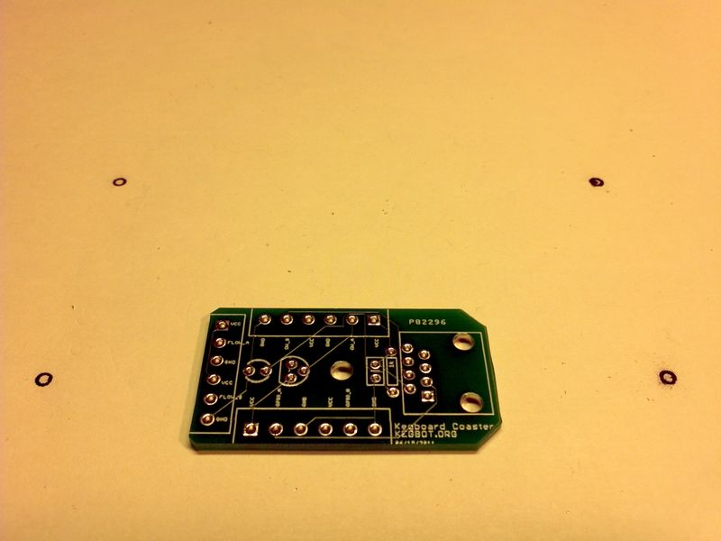
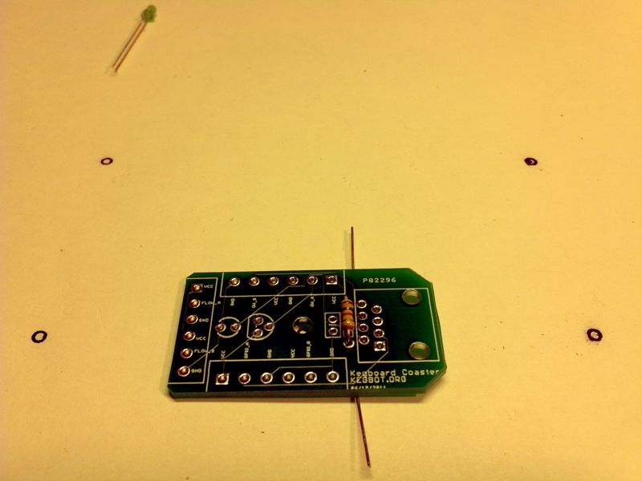
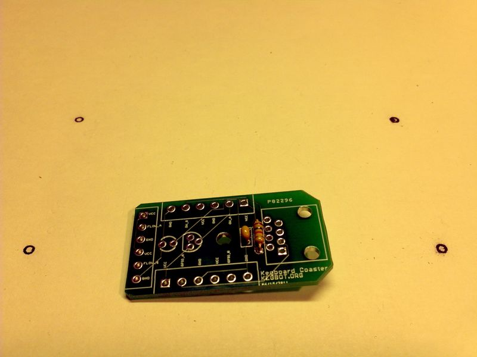
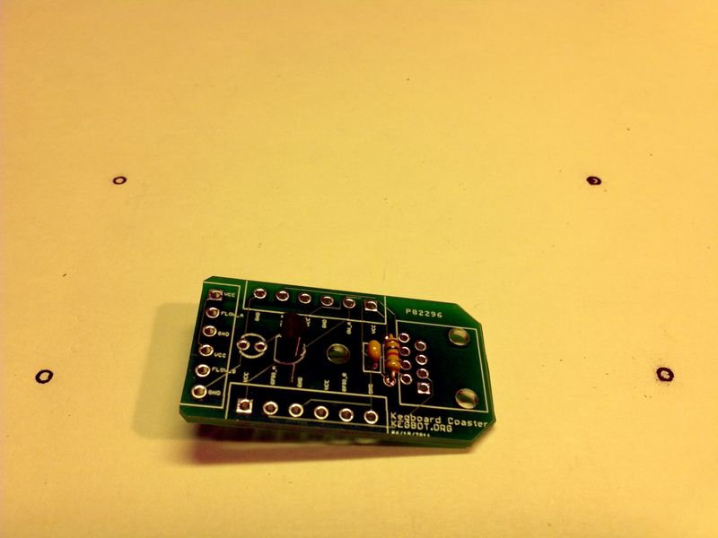
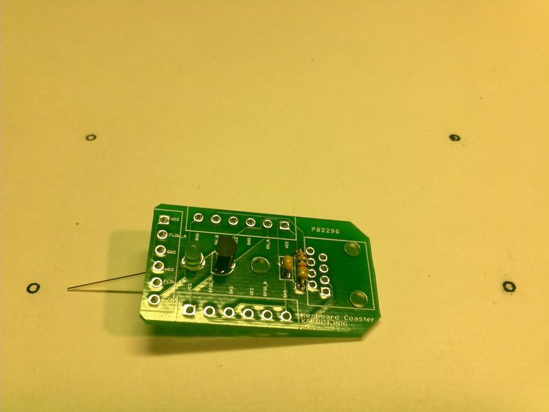
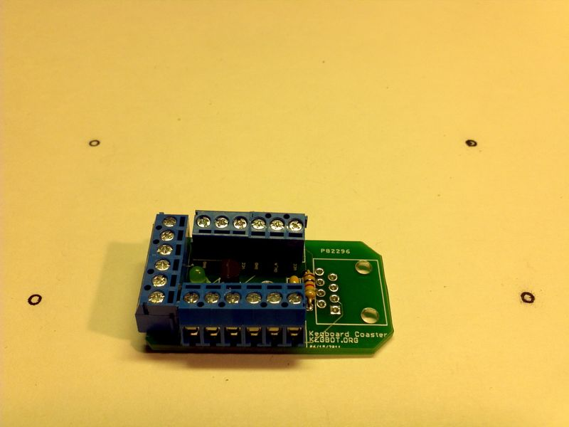
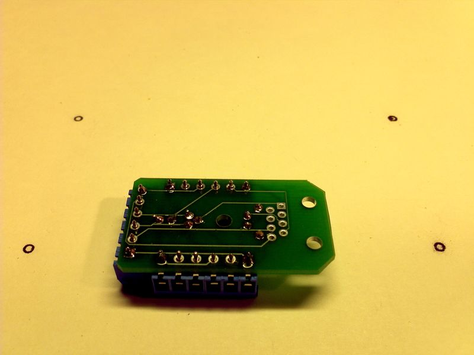
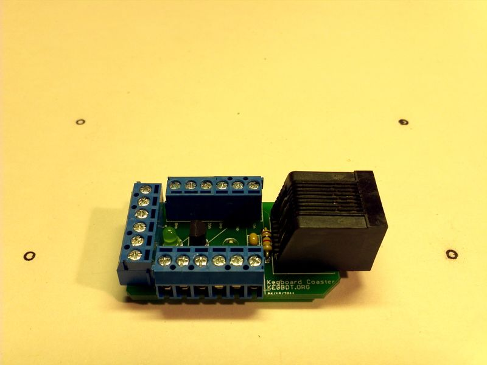
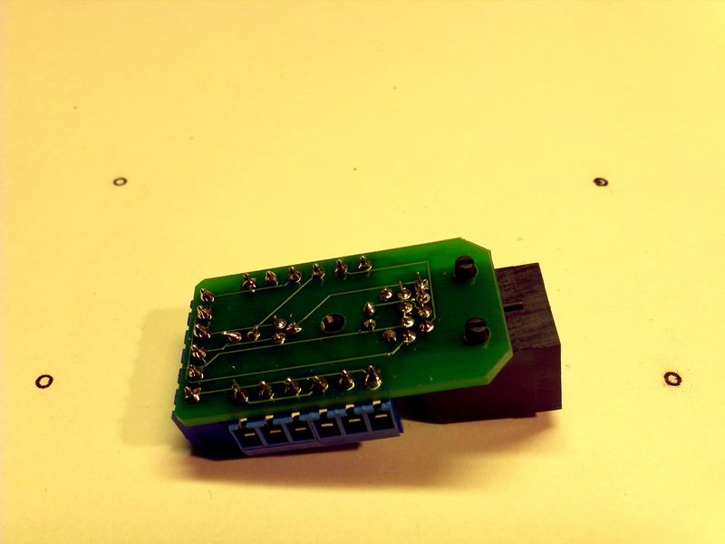
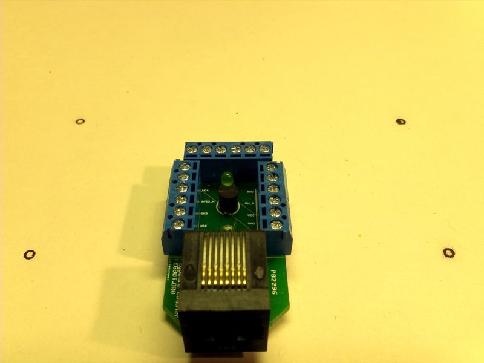

=======================
Assembling a Coaster
=======================

Step-by-Step Assembly Instructions
==================================

Step 1: Discretes
-----------------

To begin, solder one 1k resistor (Brown-Black-Red-Gold) to the kegboard-coaster
PCB. Follow the same steps as above (Bend resistor, place on PCB, solder, cut
off excess wire leads, inspect solder joint). 

Next, solder the yellow ceramic capacitor to the kegboard-coaster PCB. Ceramic
capacitors are not polarized so you can put them in "either way" and they work
fine.

Step 2: Temperature Sensor
--------------------------

Next, solder the Onewire temperature sensor (DS18B20) to the kegboard-coaster
PCB. Make sure the flat side of the temperature sensor matches the outline on
the silkscreen. Bend the middle pin slightly forward to help when inserting the
part into the kegboard-coaster PCB. 

Step 3: LED
-----------

Next, solder the LED (Green) to the kegboard-coaster PCB. The negative (-) pad
for the LED is not marked on the kegboard-coaster PCB. The negative or short pin
of the LED should be soldered into the pcb towards the blue screw terminals,
with the longer pin closer to the temperature sensor.

Step 4: Jacks
-------------

Next, solder the three 6-pin Flow\Onewire\GPO screw terminals to the
kegboard-coaster PCB. Gang up two 3-pin screw terminals to make each 6-pin set.
Hold in place with tape to prevent movement during soldering.

Next, solder the RJ45 jack to the kegboard-coaster PCB. 

