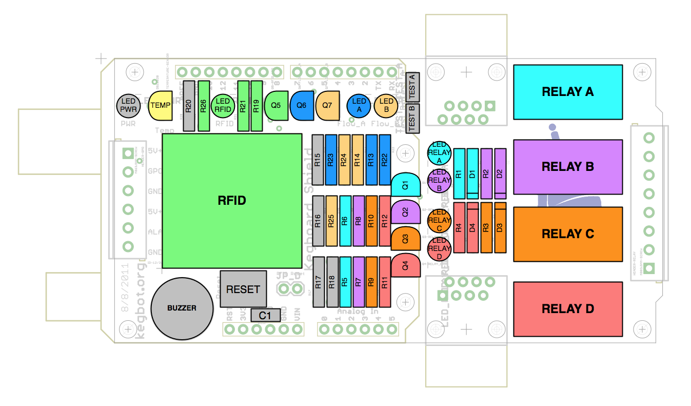

=================
Functional Blocks
=================

Kegboard Blocks
===============

Kegboard is a multi-function board.  The diagram and tables below illustrate the
division of functional roles on the Kegboard.

With the exception of the "essentials" section, all blocks are optional and may
be omitted according to your needs.

Essentials
----------

These parts are recommended for all builds, and are shown in gray.

==================== ===========================================================
Part                 Description
==================== ===========================================================
``LED_PWR``          Power LED; always on.
``R20``              Current-limiting resistor for power LED.
``BUZZER``           Piezo buzzer.
``RESET``            Arduino reset button.
``C1``               Capacitor.
``R15,16``           Flow sense line pull-up resistors.
``R17,18``           OneWire pull-up resistors.
``TEST_A,TEST_B``    Flow sense test jumpers.
==================== ===========================================================

RFID
----

These parts enable you to make use of an onboard ID-12 RFID sensor for
authenticating users to the system, and are shown in light green.

==================== ===========================================================
Part                 Description
==================== ===========================================================
``RFID``             ID-12 RFID sensor assembly.
``R19,21,26``        Power and reset resistors.
``LED_RFID``         RFID sense LED.
``Q5``               LED_RFID power transistor.
==================== ===========================================================

Flow LEDs
---------

These LEDs light when the Kegbot firmware senses flow; they may be useful for
diagnostic purposes.

==================== ===========================================================
Part                 Description
==================== ===========================================================
``LED_A``            First indicator LED.
``Q6``               LED_A power transistor.
``R13,R22,R23``      LED_A resistors.
``LED_B``            Second indicator LED.
``Q7``               LED_B power transistor.
``R14,R24,R25``      LED_B resistors.
==================== ===========================================================

Relays
------

Up to four relays can be attached to the kegboard.  Each relay block consists of an
independent collection of parts.

==================== ===========================================================
Part                 Description
==================== ===========================================================
``RELAY_A``          Relay A.
``LED_RELAY_A``      RELAY_A LED.
``R1,R5,R6``         RELAY_A resistors.
``Q1``               RELAY_A transistor.
``D1``               RELAY_A diode.
``RELAY_B``          Relay B.
``LED_RELAY_B``      RELAY_B LED.
``R2,R7,R8``         RELAY_B resistors.
``Q2``               RELAY_B transistor.
``D2``               RELAY_B diode.
``RELAY_C``          Power relay.
``LED_RELAY_C``      RELAY_C LED.
``R3,R9,R10``        RELAY_C resistors.
``Q3``               RELAY_C transistor.
``D3``               RELAY_C diode.
``RELAY_D``          Power relay.
``LED_RELAY_D``      RELAY_D LED.
``R4,R11,R12``       RELAY_D resistors.
``Q4``               RELAY_D transistor.
``D4``               RELAY_D diode.
==================== ===========================================================

Board Temperature
-----------------

You can optionally populate this part in order to get board-level temperature
readings.

.. note::
  Board-level temperature readings may be inaccurate due heat generated by
  components on the board.

==================== ===========================================================
Part                 Description
==================== ===========================================================
``TEMP``             Temperature sensor.
==================== ===========================================================

