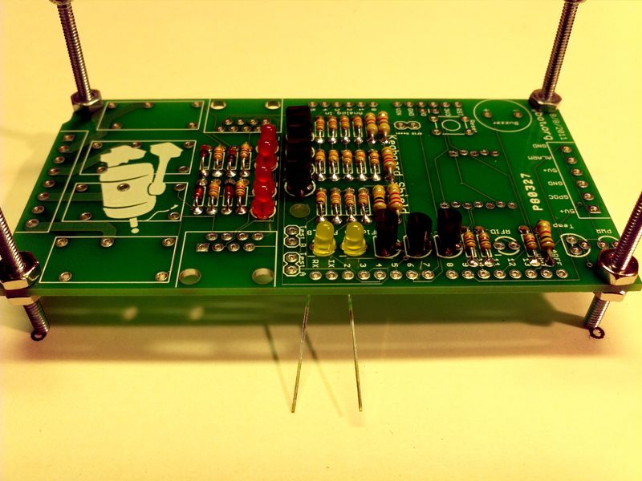
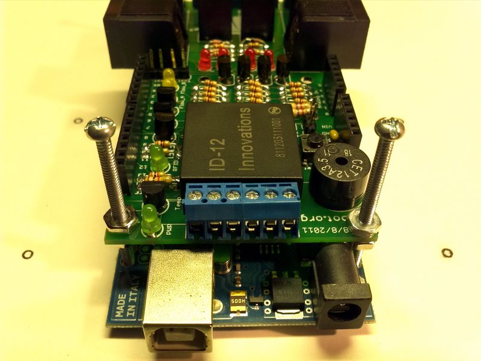

=======================
Assembling the Kegboard
=======================

Before you Start
================

Double check that sure you have all the necessary parts on the Bill of
Materials.  Make sure your toolbox is ready. And grab a drink!

Step-by-Step Assembly Instructions
==================================

In general, we will solder the components from smallest to biggest, starting in
the middle of the PCB board and working our way towards the edges. To begin,
place the PCB in a vise or third-hand holder so that it will be easy to work on.
Or build a stand using the pcb standoff holes and 4-40 bolts and nuts.

Step 1: General Resistors
-------------------------

The first components to solder are the five 10k resistors
(Brown-Black-Orange-Gold) in the middle of the kegboard pcb.

Bend the resistors into a staple shape and slip them in. Resistors do not have
*polarity* which means you can put it in 'either way' and it will work just
fine.

On the bottom side of the kegboard PCB, bend the wire legs out so that the
resistors sit flat against the top of PCB. The resistors should stay in place
when you flip the PCB over.

Using your soldering iron tip, press and heat both the pad (the silver ring
around the hole) and lead (wire) at the same time for 2 or 3 seconds. Then
insert the tip of the solder in. It doesn't take much solder to fill the joint.
Pull back the solder and then pull back the soldering iron tip. Do this for the
remaining leads of the resistors.

Solder joints should be smooth and shiny and fill the entire pad, wicking up to
the lead. You shouldn't be able to wiggle the wire and have it move in the hole.
Don't forget to clean your soldering iron tip often.

Using diagonal cutters, cut off the long leads just above the solder joint.

Next, solder four 1k resistors (Brown-Black-Red-Gold) in the middle bottom of
the kegboard PCB. Follow the same steps as above (Bend resistor, place on PCB,
solder, cut off excess wire leads, inspect solder joint).

Next, solder four 1k resistors (Brown-Black-Red-Gold) in the middle top of the
kegboard PCB. 

Next, solder one 10k resistor (Brown-Black-Orange-Gold) in the top middle of the
kegboard PCB.

Next, solder two 2.2k resistors (Red-Red-Red-Gold) in the middle of the kegboard
PCB.

Next, solder two 4.7k resistors (Yellow-Purple-Red-Gold) in the middle of the kegboard PCB. 

Step 2: Relay Block Discretes
-----------------------------

Next, solder four transistors (NPN 2N3904) in the middle of the kegboard PCB.
The transistors are in a TO-92 package, with a semi-cylindrical plastic part and
three legs. There is another TO-92 part which is the Onewire temperature sensor.
These two parts look very very similar but are completely different so its
important to look carefully and make sure that you are going to solder in the
part that says 2N3904. Because of the way the pads are layed out, the transistor
wont sit flat against the PCB. Thats OK, it should stick up a little bit. Make
sure the flat side of the transistor matches the outline on the silkscreen. Bend
the middle pin slightly forward to help when inserting the part into the
kegboard PCB.

Next, solder four diodes (1N4148) in the middle right of the kegboard PCB.
Diodes only conduct electricity in one direction. This means we can use them to
protect our circuitry from negative voltages - a top killer of electronics! Bend
the diode into a staple like so. Note that one side has a white/silver/black
stripe on it. The silkscreen on kegboard PCB also has a white stripe showing
which direction the diode should be placed.

Next, solder four 1k resistors (Brown-Black-Red-Gold) in the middle right of the
kegboard PCB.

Next, solder four LED's (RED) in the middle of the kegboard PCB. LEDs are
polarized, unlike resistors, the long lead is the positive (+) lead and the
short lead is the negative (-) lead. Make sure the LED is placed correctly
otherwise it wont work! The kegboard PCB has the negative pads marked with a
dash (-).

Next, solder four 1k resistors (Brown-Black-Red-Gold) in the upper left of the
kegboard PCB.

Next, solder three transistors (NPN 2N3904) in the upper middle of the kegboard
PCB.

Step 3: Flow LEDs
-----------------

Next, solder two LED's (Yellow) in the top middle of the kegboard PCB. The
location is marked on the kegboard PCB as FLOW_A and FLOW_B.

Next, solder two LED's (Green) in the top left of the kegboard PCB. The location
is marked on the kegboard PCB as PWR and RFID. 

Step 4: Temperature Sensor
--------------------------

Next, solder the Onewire temperature sensor (DS18B20) in the top left of the
kegboard PCB. The temperature sensor is also in a TO-92 package, with a
semi-cylindrical plastic part and three legs. Make sure the flat side of the
temperature sensor matches the outline on the silkscreen. Bend the middle pin
slightly forward to help when inserting the part into the kegboard PCB. 

Step 5: Test Headers
--------------------

Next, solder the two test flow pin headers in the top middle of the kegboard
PCB. You might what to hold the pin header in place with a small piece of tape.
Double check that they are straight and plumb to the kegboard PCB. 

Next, solder the RFID reset pin header in the bottom middle of the kegboard PCB.

Step 6: Capacitor, Switch, and Buzzer
-------------------------------------

Next, solder the yellow ceramic capacitor in the bottom middle of the kegboard
PCB. Ceramic capacitors are not polarized so you can put them in "either way"
and they work fine. 

Next, solder the 6mm tactile switch in the bottom left of the kegboard PCB. The
tactile switch is used to reset the Arduino since its not possible to reach the
reset button once the kegboard shield is on. The tactile switch can go in
'either way'.

Next, solder the 12mm round buzzer in the bottom left of the kegboard PCB. Note
the positive pin of the buzzer and the positive (+) pin on the kegboard PCB. 

Intermission
------------

That's all the small discrete components. Now's a good time to double check all
of the solder joints.

Step 7: RFID
------------

Next, solder the RFID ID/12 chip onto the kegboard PCB. Note, the ID/12 will be
tough to insert into the PCB board. The footprint holes are offset to hold it in
place during soldering. Turn the PCB over and solder the pins. Start with the
four corners to further help hold it in place and then finish the rest of the
pins.

Step 8: Pin Headers
-------------------

Next, solder the Arduino stackable pin headers (2-8 pin and 2-6 pin) to the
kegboard PCB. You really want to hold these pin headers down with tape or
something similar. Check the placement of the pin headers so that they are
straight, plumb and inline with each other. Start soldering the pins on the end
of each pin header and double check that they are still straight, plumb and
inline with each other before soldering the rest of the middle pins. 

.. image:: _static/images/41.jpg

.. image:: _static/images/43.jpg

Step 9: RJ45s
-------------

Next, solder the two RJ45 jacks to the kegboard PCB. 

Step 10: Relay Block
--------------------

Next, solder the four Omron SPDT relays to the kegboard PCB. Solder one or two
relays at a time to make sure they stay flat against the kegboard PCB. Hold each
relay in place with tape to prevent movement when turning the kegboard PCB over.
Make sure to heat the pad and relay pin well and fill with a good amount of
solder. These solder joints do require slightly more solder to fill the joint. 

Next, solder the 8-pin Relay Input\Output screw terminals to the right side of
the kegboard PCB. Gang up two 3-pin screw terminals with a 2-pin screw terminal
to make the large 8-pin set. Again hold in place with tape to prevent movement
during soldering.

.. image:: _static/images/53.jpg

Next, solder the 6-pin Alarm\GPO screw terminals to the left side of the
kegboard PCB. Gang up two 3-pin screw terminals to make the 6-pin set. Also hold
in place with tape to prevent movement during soldering. 

Finished!
--------

Congrats that should be 62 parts that you just finished soldering to your
kegboard PCB. Now is a good time to look over your kegboard for any missed or
bad solder joints. 

